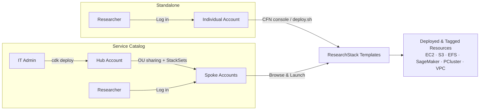

# ResearchStack on AWS

Deploy research computing infrastructure on AWS in minutes — EC2, S3, EFS, SageMaker, ParallelCluster, and more — with built-in security, cost tracking, and governance. From a single researcher to a multi-account institution.

> **Note:** Review templates against your institution's security and compliance requirements before production use. These templates follow AWS security best practices (encryption, IMDSv2, least-privilege IAM).

## Why ResearchStack?

- **Researchers**: Deploy compute and storage in minutes, not days. No networking or IAM knowledge needed — just pick a template, fill in your project name and cost center, and launch.
- **IT admins**: Give researchers self-service access to standardized, security-hardened infrastructure. Every deployment follows the same architecture, making troubleshooting repeatable.
- **FinOps teams**: Every resource is automatically tagged with project, cost center, and owner — ready for [Cost Explorer](https://aws.amazon.com/aws-cost-management/aws-cost-explorer/) or [Data Exports](https://docs.aws.amazon.com/cur/latest/userguide/what-is-data-exports.html) for grant chargeback without manual tagging.

## Templates

| Category | Template | What it does |
|----------|----------|-------------|
| Compute | ec2-general-purpose.yaml | M-series instances for balanced workloads |
| Compute | ec2-compute-optimized.yaml | C-series instances for simulations and batch processing |
| Compute | ec2-memory-optimized.yaml | R-series instances for genomics and large datasets |
| Compute | ec2-accelerated-gpu.yaml | GPU instances (G-series) for ML training and inference |
| Compute | ec2-spot-fleet.yaml | Cost-optimized Spot instances across multiple types and AZs (up to 70% savings) |
| Compute | parallelcluster-hpc.yaml | Slurm HPC cluster with auto-scaling and optional remote desktop |
| Storage | s3-research-bucket.yaml | Encrypted S3 bucket with versioning and intelligent tiering |
| Storage | efs-shared-storage.yaml | Shared network filesystem (NFS) across multiple instances |
| Storage | s3-files.yaml | Mount S3 as a POSIX filesystem via NFS (~13x cheaper than EFS) |
| Storage | fsx-lustre.yaml | High-throughput parallel filesystem for compute-intensive I/O |
| ML | sagemaker-studio.yaml | Managed Jupyter environment with GPU support |
| Governance | budget-alert.yaml | Monthly budget tracking by cost center with email alerts |
| Networking | research-vpc.yaml | VPC with public/private subnets, NAT gateway, S3 endpoint |

All templates include idle shutdown (EC2), cost tracking tags, encryption, and security defaults. See the [Templates README](templates/README.md) for parameter details, instance type guidance, and OS options.

Not sure which template fits your work? See the [Research Lifecycle Guide](docs/research-lifecycle-guide.md) or the [Cost Optimization Guide](docs/cost-optimization-guide.md).

## Quick Start

**Prerequisites**: An AWS account with administrator or [PowerUserAccess](https://docs.aws.amazon.com/aws-managed-policy/latest/reference/PowerUserAccess.html) permissions. If your institution manages accounts via [AWS Organizations](https://aws.amazon.com/organizations/), ask your cloud team which account to use. For CLI deployments, install the [AWS CLI](https://docs.aws.amazon.com/cli/latest/userguide/getting-started-install.html) and [configure credentials](https://docs.aws.amazon.com/cli/latest/userguide/cli-configure-sso.html).

### Deploy via AWS Console (recommended)

The console provides dropdowns for VPCs, subnets, and instance types — easiest for most users.

1. Open the [CloudFormation console](https://console.aws.amazon.com/cloudformation/home#/stacks/create)
2. Upload a template YAML from [`templates/`](templates/README.md)
3. Fill in parameters (at minimum: ProjectName, CostCenter, VPC, subnet). Any value works for ProjectName and CostCenter if you're just testing.
4. Create stack

Most templates require a VPC. Deploy the [Research VPC](templates/README.md#networking-networking) template first if you don't have one.

### Deploy via CLI (repeatable deployments)

For scripted or repeatable deployments, use `deploy.sh` with a parameter file. Pre-built configs for every template are in `params/` — copy one, fill in your values (VPC, subnet, project name), and deploy:

```bash
# 1. Copy a parameter file and fill in your values
cp params/compute-ec2.json params/my-project.json
# Edit my-project.json — replace REPLACE_ME with your VPC, subnet, project name, etc.

# 2. Preview the deployment
./deploy.sh --config params/my-project.json --dry-run

# 3. Deploy
./deploy.sh --config params/my-project.json
```

See [params/README.md](params/README.md) for all available configs and commands to find your VPC/subnet IDs.

### Deploy via Service Catalog

For institutions managing multiple AWS accounts with governed self-service. Researchers browse a catalog and click "Launch" — no CloudFormation knowledge needed. See the [Service Catalog Guide](docs/service-catalog-guide.md).

### Accessing Your Resources

After deployment, check the CloudFormation stack outputs for connection details, resource IDs, and next steps specific to your template. In the console: CloudFormation → your stack → Outputs tab. Via CLI:

```bash
aws cloudformation describe-stacks --stack-name my-stack --query 'Stacks[0].Outputs' --output table
```

For Service Catalog deployments, outputs are under Provisioned Products → your product → Outputs.

### Deleting Resources

Delete the CloudFormation stack to clean up all resources and stop costs. S3 buckets with data must be [emptied first](https://docs.aws.amazon.com/AmazonS3/latest/userguide/empty-bucket.html) — CloudFormation cannot delete a non-empty bucket. Delete compute/storage stacks before the VPC stack.

## Cost Tracking and Access Control

All resources are tagged automatically: Project, CostCenter, Owner, ManagedBy, Environment. Use these in [Cost Explorer](https://console.aws.amazon.com/cost-management/home#/cost-explorer) for quick visibility or [Data Exports](https://docs.aws.amazon.com/cur/latest/userguide/what-is-data-exports.html) for detailed CSV-based per-grant chargeback. If you're just testing, any value works for ProjectName and CostCenter — they're resource tags, not billing constructs. See the [Cost Optimization Guide](docs/cost-optimization-guide.md) for budgets, Savings Plans, and F&A guidance.

For access control, we recommend [IAM Identity Center](https://aws.amazon.com/iam/identity-center/) (IDC) as the identity foundation — single sign-on across all your AWS accounts. The simplest model is account-level isolation: one AWS account per lab or research group, with IDC permission sets granting access. The account boundary is the access control. See [`examples/researcher-policy.json`](examples/researcher-policy.json) for a ready-to-use least-privilege IAM policy (Service Catalog, SSM, EC2 start/stop, S3, SageMaker Studio, and Cost Explorer access). For Service Catalog deployments, see [Granting Portfolio Access](docs/service-catalog-guide.md#granting-portfolio-access).

## Architecture

ResearchStack supports two deployment paths:



- **Standalone**: deploy templates directly via the CloudFormation console or CLI — simplest for single accounts
- **[Service Catalog](https://aws.amazon.com/servicecatalog/)**: governance layer with launch roles, OU sharing, and self-service catalog — best for multi-account institutions

Both paths use the same templates and produce the same tagged resources.

## Repository Structure

```
researchstack/
├── templates/                # CloudFormation templates (the core product)
│   ├── compute/             # EC2, ParallelCluster
│   ├── storage/             # S3, EFS, S3 Files, FSx Lustre
│   ├── ml/                  # SageMaker
│   ├── networking/          # VPC
│   └── governance/          # Budget alerts
├── params/                   # Parameter files for deploy.sh
├── examples/                 # Researcher IAM policy
├── deploy.sh                 # CLI deploy helper
├── service-catalog/          # CDK code for Service Catalog governance layer
├── docs/                    # Guides and documentation
└── ADRs/                    # Architecture Decision Records
```

## Documentation

- [Templates README](templates/README.md) — Template details, instance types, OS options
- [Parameter Files](params/README.md) — Deploy configs and resource lookup commands
- [Research Lifecycle Guide](docs/research-lifecycle-guide.md) — Map research phases to templates
- [Cost Optimization Guide](docs/cost-optimization-guide.md) — Budgeting, Savings Plans, F&A
- [FAQ](docs/faq.md) — Connecting, costs, security, configuration
- [ParallelCluster Guide](docs/parallelcluster-guide.md) — HPC cluster deployment and customization
- [Service Catalog Guide](docs/service-catalog-guide.md) — Multi-account governance setup
- [Contributing Guide](CONTRIBUTING.md) — Template standards and submission process

## Support

- **Issues**: [GitHub Issues](https://github.com/awslabs/researchstack-on-aws/issues)
- **Discussions**: [GitHub Discussions](https://github.com/awslabs/researchstack-on-aws/discussions)
- **AWS Support**: Contact your AWS account team

## License

Apache License 2.0 — see [LICENSE](LICENSE).
