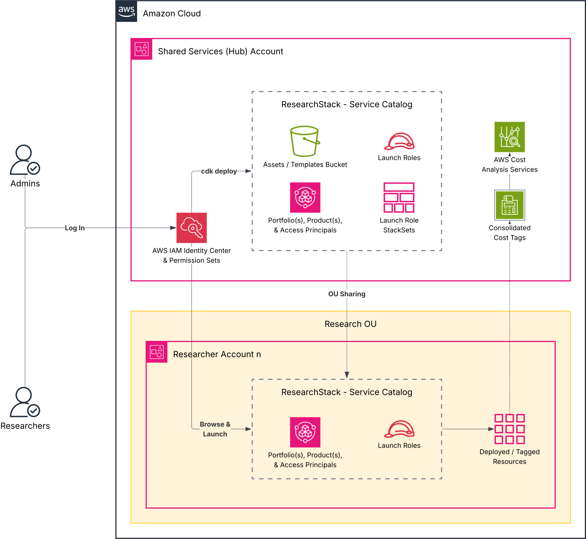

# Service Catalog Deployment Guide

Deploy governed, self-service research computing across multiple AWS accounts. Researchers browse a catalog and click "Launch" — no CloudFormation knowledge needed. IT admins control what's available, who can launch it, and what permissions each product gets.

This guide walks through setting up the [AWS Service Catalog](https://aws.amazon.com/servicecatalog/) layer on top of ResearchStack's CloudFormation templates. It follows a hub-and-spoke model: one central account manages portfolios and shares them to researcher accounts across your organization.

## Architecture

The Service Catalog layer adds governance on top of the same templates you can deploy standalone. Here's how the pieces fit together:



**Hub account** — A designated AWS account (not the management account) where [CDK](https://aws.amazon.com/cdk/) deploys the Service Catalog portfolio, products, and an S3 bucket for template artifacts. This account is registered as a [delegated administrator](https://docs.aws.amazon.com/organizations/latest/userguide/orgs_integrate_services_list.html) for Service Catalog and CloudFormation StackSets, so it can manage resources across the organization without using the management account (which should be reserved for billing and [Organizations](https://aws.amazon.com/organizations/) administration only — keeping workloads out of the management account is an [AWS security best practice](https://docs.aws.amazon.com/organizations/latest/userguide/orgs_best-practices_mgmt-acct.html)).

**Portfolio** — A collection of products shared to specific [Organizational Units (OUs)](https://docs.aws.amazon.com/organizations/latest/userguide/orgs_manage_ous.html). The portfolio name and description are what researchers see when browsing the [Service Catalog console](https://console.aws.amazon.com/servicecatalog/). Defined in a TOML config file.

**Products** — Each ResearchStack CloudFormation template wrapped for Service Catalog. Researchers see a product name, description, and a "Launch" button — they fill in parameters and get their resources. The product name and description are what researchers see when browsing within a portfolio.

**Launch roles** — Per-product [IAM roles](https://docs.aws.amazon.com/IAM/latest/UserGuide/id_roles.html) that Service Catalog assumes when creating resources on behalf of a researcher. Each product gets only the permissions it needs (e.g., the S3 product gets `AmazonS3FullAccess`, not admin access). Created in the hub account by CDK, then deployed to every spoke account via StackSets.

**[StackSets](https://docs.aws.amazon.com/AWSCloudFormation/latest/UserGuide/what-is-cfnstacksets.html)** — CloudFormation's built-in mechanism for deploying the same template to multiple accounts. Here, they push launch roles into every account in the target OUs. When a new account is added to an OU, the launch role is deployed automatically.

**OU sharing** — The portfolio is shared at the [OU](https://docs.aws.amazon.com/organizations/latest/userguide/orgs_manage_ous.html) level, so every account in the OU sees it. Researchers in spoke accounts browse the shared portfolio and launch products using the launch roles that StackSets deployed into their account.

**[Access principals](https://docs.aws.amazon.com/servicecatalog/latest/adminguide/catalogs_portfolios_users.html)** — IAM role ARN patterns that control who can see and launch products. When a principal pattern is associated with the portfolio and sharing is enabled (`share_principals = true`), any user in any spoke account whose IAM role matches the pattern gets access automatically. This means an IDC permission set assigned across multiple accounts grants portfolio access in all of them — no per-account configuration needed.

## Why CDK?

The Service Catalog layer uses [AWS CDK](https://aws.amazon.com/cdk/) (Cloud Development Kit) with Python as the infrastructure-as-code tool. CDK generates [CloudFormation](https://aws.amazon.com/cloudformation/) templates from Python code, giving us:

| What CDK handles | Where we use it |
|---|---|
| Dependency ordering | Portfolio → products → launch roles → StackSets must deploy in sequence |
| StackSet lifecycle | Creating, updating, and deleting launch roles across accounts |
| State tracking | CDK knows what's deployed and only changes what's different |
| Asset management | Uploads template files to S3 automatically |

You don't need to know CDK or Python to use this — just edit config files and run `cdk deploy`. For code architecture details, see the [Service Catalog Developer Guide](../service-catalog/README.md).

## Prerequisites

### AWS Account Setup

1. **[AWS Organizations](https://docs.aws.amazon.com/organizations/latest/userguide/orgs_getting-started.html) enabled** — Service Catalog OU sharing and StackSets both require Organizations.

2. **A hub account registered as delegated administrator** — Pick one account (not the management account — the management account should be reserved for billing and Organizations administration, not workload deployment). Run these two commands from the **management account** using the [AWS CLI](https://docs.aws.amazon.com/cli/latest/userguide/getting-started-install.html) or [CloudShell](https://aws.amazon.com/cloudshell/) (available in the AWS console — no install needed):
   ```bash
   # Delegate Service Catalog admin to hub account
   aws organizations register-delegated-administrator \
     --account-id HUB_ACCOUNT_ID \
     --service-principal servicecatalog.amazonaws.com

   # Enable StackSets service access across the org
   aws organizations enable-aws-service-access \
     --service-principal member.org.stacksets.cloudformation.amazonaws.com
   ```

3. **Target OU IDs identified** — Know which OUs contain the accounts where researchers will consume templates. Find OU IDs in the [AWS Organizations console](https://console.aws.amazon.com/organizations/) — they look like `ou-xxxx-xxxxxxxx`. Start with a single "Research" OU. As your organization scales, you can split into purpose-specific OUs (e.g., Research-Sandbox, Research-HIPAA). See [Organizing Your AWS Environment](https://docs.aws.amazon.com/whitepapers/latest/organizing-your-aws-environment/organizing-your-aws-environment.html) for best practices, and consider [Landing Zone Accelerator](https://aws.amazon.com/solutions/implementations/landing-zone-accelerator-on-aws/) for compliance-heavy setups.

### Local Tools

- **Python 3.11+** — [python.org](https://www.python.org/downloads/) or your system package manager
- **Node.js 18+** — Required by the CDK CLI. [nodejs.org](https://nodejs.org/)
- **AWS CDK CLI** — `npm install -g aws-cdk` (after Node.js is installed)
- **AWS CLI** — [Install guide](https://docs.aws.amazon.com/cli/latest/userguide/getting-started-install.html). Configure credentials for the hub account: `aws configure sso` for [IAM Identity Center](https://docs.aws.amazon.com/cli/latest/userguide/cli-configure-sso.html) (recommended) or `aws configure` for [access keys](https://docs.aws.amazon.com/cli/latest/userguide/cli-authentication-user.html).

Verify:
```bash
python3 --version            # 3.11+
node --version               # 18+
cdk --version                # 2.x
aws sts get-caller-identity  # should show your hub account ID (add --profile your-profile-name if using named profiles)
```

## Configuration

Two config files control what gets deployed and where. Edit these before running `cdk deploy`.

### 1. Framework Config (`service-catalog/framework_config.yaml`)

Sets your deployment target — which account, region, and org to deploy into:
```yaml
deployment:
  hub_account: "123456789012"       # Your hub account ID
  hub_region: "us-east-1"           # Deployment region
  organization_id: "o-exampleorgid" # Your AWS Organization ID
  default_env_name: "dev"

available_ous:
  - "ou-xxxx-xxxxxxxx"  # Approved OUs that portfolios can share to
```

The `available_ous` list acts as a guardrail — portfolio configs can only share to OUs listed here. This prevents accidental sharing to the wrong OU (a typo in a portfolio TOML would be caught at synthesis time, not at deploy time with a cryptic StackSet error).

### 2. Portfolio Config (`service-catalog/portfolios/*.toml`)

Each TOML file defines one portfolio with its products. The example `research-computing.toml` includes all ResearchStack templates. Customize it:

- Add/remove products by editing `[[portfolio.products]]` entries
- Set `share_target_ous` to the OUs you want to share with
- Set `access_principals` to grant portfolio access automatically (see [Granting Portfolio Access](#granting-portfolio-access)). If you're not ready to configure this yet, leave the field as an empty list (`[]`) and grant access manually in the SC console after deployment.
- Each product's `launch_role_policies` declares the AWS managed policies its launch role needs

To create additional portfolios (e.g., separate catalogs for different departments), create a new TOML file in the same directory. For a complete field reference, see [Configuration Reference](#configuration-reference).

## Deployment

Deploy from the `service-catalog/` directory. Based on your configs, CDK creates the assets bucket, portfolio, products, launch roles, and StackSets. Add `--profile your-profile-name` to CDK commands if using named AWS CLI profiles.

```bash
cd service-catalog

# Set up Python environment
python3 -m venv .venv
source .venv/bin/activate
pip install -e .

# Bootstrap CDK (first time only, per account/region)
cdk bootstrap aws://ACCOUNT_ID/REGION

# Optional: validate before deploying
cdk synth

# Deploy all stacks (assets bucket + portfolio stacks)
cdk deploy --all
```

`cdk deploy --all` runs synthesis automatically, so `cdk synth` is optional — useful for catching config errors before hitting AWS.

## Granting Portfolio Access

Researchers need access to the portfolio before they can launch products. The recommended approach is to define [principal ARN patterns](https://docs.aws.amazon.com/servicecatalog/latest/adminguide/catalogs_portfolios_users.html) in your portfolio TOML — this grants access automatically in the hub account and propagates to all spoke accounts via [principal sharing](https://docs.aws.amazon.com/servicecatalog/latest/adminguide/catalogs_portfolios_sharing.html).

### Recommended: Automated via TOML Config

Add `access_principals` to your portfolio TOML with IAM principal ARN patterns. Wildcards are supported, which is useful for [IAM Identity Center](https://aws.amazon.com/iam/identity-center/) roles where the suffix varies per IDC instance.

This works when the specified roles exist across all spoke accounts. IDC [permission sets](https://docs.aws.amazon.com/singlesignon/latest/userguide/permissionsetsconcept.html) automatically create matching IAM roles in every assigned account, making them a natural fit.

```toml
access_principals = [
    "arn:aws:iam:::role/aws-reserved/sso.amazonaws.com/AWSReservedSSO_AdministratorAccess*",
    "arn:aws:iam:::role/aws-reserved/sso.amazonaws.com/AWSReservedSSO_AWSServiceCatalogEndUserAccess*"
]
```

The sample config includes two principals:
- `AdministratorAccess` — for IT admins who manage the portfolio, test products, and troubleshoot deployments
- `AWSServiceCatalogEndUserAccess` — for researchers who browse and launch products (this is an [AWS-managed permission set](https://docs.aws.amazon.com/singlesignon/latest/userguide/permissionsetsconcept.html) available in IDC by default)

For production use, we recommend creating a custom "Researcher" permission set in IDC that combines SC end-user access with the additional permissions researchers need day-to-day (e.g., SSM Session Manager for connecting to instances, EC2 start/stop, S3 data access, SageMaker Studio, Cost Explorer for budget visibility). See [`examples/researcher-policy.json`](../examples/researcher-policy.json) for a ready-to-use policy you can attach to a custom IDC permission set. Once created, add its ARN pattern to `access_principals` in your portfolio TOML (e.g., `"arn:aws:iam:::role/aws-reserved/sso.amazonaws.com/AWSReservedSSO_Researcher*"`) and run `cdk deploy --all`. This avoids giving researchers full admin while still letting them be productive beyond just launching products. If you're not using IDC, create equivalent IAM roles in each spoke account and reference them here.

Note: the simplest access control model is account-level isolation — one AWS account per lab or research group, with IDC permission sets granting access. Researchers get broad permissions within their account because everything in it belongs to their project. The account boundary is the access control. See the [main README](../README.md#cost-tracking-and-access-control) for more on this approach.

Then run `cdk deploy --all`. Service Catalog associates these patterns with the portfolio and — because `share_principals = true` — automatically grants access to matching roles in every spoke account.

**ARN format:**

| Role type | ARN pattern |
|-----------|-------------|
| IDC (Identity Center) | `arn:aws:iam:::role/aws-reserved/sso.amazonaws.com/AWSReservedSSO_PermissionSetName*` |
| Standard IAM role | `arn:aws:iam:::role/RoleName` |

IDC roles live under the `aws-reserved/sso.amazonaws.com/` path — this must be included in the ARN pattern.

### Alternative: Manual Console Grant

For one-off access or spoke-account-specific overrides:

1. Open the [Service Catalog console](https://console.aws.amazon.com/servicecatalog/) in the target account
2. Go to **Portfolios** → click your portfolio (or **Imported** in spoke accounts)
3. Click **Access** → **Grant access**
4. Select the principal type and enter the role name or ARN

## Verify Your Deployment

After `cdk deploy --all` completes, verify everything is working:

1. **Hub account** — Open the [Service Catalog console](https://console.aws.amazon.com/servicecatalog/) in the hub account. Under **Portfolios** → **Local portfolios**, you should see your portfolio with all products listed.

2. **Spoke account** — Sign into a spoke account in one of the target OUs. Under **Portfolios** → **Imported portfolios**, you should see the shared portfolio. Under **Products**, each product should be displayed.

3. **Launch roles** — In the spoke account, go to [IAM → Roles](https://console.aws.amazon.com/iam/home#/roles) and search for your project slug (e.g., `rs-`). You should see one launch role per product (e.g., `rs-dev-research-computing-s3-research-bucket-lc`).

4. **Test launch** — In the spoke account, launch a simple product (e.g., the S3 bucket). Verify it creates successfully and the resources are tagged with Project, CostCenter, Owner, ManagedBy, and Environment. For EC2 products, connect to the instance using the SSM Session Manager command from the stack outputs.

If any step fails, see [Troubleshooting](#troubleshooting) below.

## Updating Products

- **Update a template**: Edit the YAML file in `templates/`, then `cdk deploy --all`. SC updates the product's provisioning artifact. Existing provisioned resources are unaffected.
- **Add a new product**: Add a `[[portfolio.products]]` entry to your portfolio TOML, then deploy.
- **Remove a product**: Remove it from the TOML and deploy. Existing provisioned resources continue running.
- **Researcher self-service updates**: Researchers can update their own provisioned products in the [SC console](https://console.aws.amazon.com/servicecatalog/) — go to **Provisioned products**, select the product, and click **Update**. This lets them change parameters (e.g., instance type, volume size) without IT involvement.

## Deleting Resources

### Researchers: Terminate Provisioned Products

Researchers can delete their own resources in the [Service Catalog console](https://console.aws.amazon.com/servicecatalog/):

1. Go to **Provisioned products**
2. Select the product
3. Choose **Actions** → **Terminate**

This deletes the underlying CloudFormation stack and all resources it created. Terminated products stop incurring costs immediately (except for any data retained in S3 buckets with deletion protection).

### IT Admins: Tear Down the Service Catalog Infrastructure

To remove the entire Service Catalog layer (portfolios, products, launch roles, StackSets, assets bucket):

```bash
cd service-catalog
source .venv/bin/activate
cdk destroy --all
```

This does not affect resources that researchers have already provisioned — those are independent CloudFormation stacks in spoke accounts. Researchers (or IT admins) must terminate provisioned products separately before or after tearing down the SC infrastructure.

### Deleting a Portfolio

To remove a specific portfolio, run `cdk destroy` with the stack name **before** removing the TOML file:

```bash
cdk destroy rs-dev-research-computing-portfolio-stack
```

If you already removed the TOML, CDK can't find the stack. Use CloudFormation directly:

```bash
aws cloudformation delete-stack --stack-name rs-dev-research-computing-portfolio-stack
```

Stack names follow the pattern `{slug}-{env}-{portfolio-name}-portfolio-stack`. Check the [CloudFormation console](https://console.aws.amazon.com/cloudformation/) if you're unsure of the exact name.

### A Note on `default_env_name`

The `default_env_name` in `framework_config.yaml` is baked into every stack name (e.g., `rs-dev-*` vs `rs-test-*`). Changing it after deploying doesn't update existing stacks — it creates a parallel set of stacks under the new name. This is by design if you want separate environments (e.g., `dev` and `prod` side by side), but if you're just renaming, destroy the old stacks first to avoid duplicates.

## Configuration Reference

Complete reference for every configurable field. Fields marked (required) must be set before deploying.

### Framework Config Fields (`framework_config.yaml`)

| Field | Type | Required | Default | Description |
|-------|------|----------|---------|-------------|
| `deployment.hub_account` | String | Yes | — | 12-digit AWS account ID for the hub account |
| `deployment.hub_region` | String | Yes | — | AWS region for deployment (e.g., `us-east-1`) |
| `deployment.organization_id` | String | Yes | — | AWS Organization ID (format: `o-xxxxxxxxxx`). Used for S3 bucket org-wide read policy |
| `deployment.default_env_name` | String | No | `dev` | Environment name baked into resource names (e.g., `dev`, `staging`, `prod`) |
| `available_ous` | List of strings | Yes | — | OU IDs that portfolios are allowed to share to. Format: `ou-xxxx-xxxxxxxx` |
| `tagging.required_tags` | Map | No | `{}` | Tags applied to the CDK-managed infrastructure stacks themselves (not to researcher-provisioned resources — those are tagged by the templates). Use for identifying SC infrastructure, e.g., `Project: ResearchStack`, `ManagedBy: ServiceCatalog`. |

### Portfolio Config Fields (`portfolios/*.toml`)

**Portfolio section (`[portfolio]`)** — defines the portfolio that researchers see in the [Service Catalog console](https://console.aws.amazon.com/servicecatalog/):

| Field | Type | Required | Default | Description |
|-------|------|----------|---------|-------------|
| `name` | String | Yes | — | Portfolio machine identifier (used in CDK stack names and IAM role names — no spaces, alphanumeric + hyphens) |
| `display_name` | String | Yes | — | Portfolio name shown to researchers in the SC console |
| `description` | String | No | `""` | Portfolio description shown in the SC console |
| `provider_name` | String | No | `"ResearchStack on AWS"` | Organization name shown as the portfolio publisher (e.g., your institution name) |
| `support_email` | String | No | `""` | Support email shown on all products in this portfolio |
| `support_url` | String | No | `""` | Support URL shown on all products |
| `support_description` | String | No | `""` | Support description text shown on all products |
| `distributor` | String | No | `""` | Distributor name shown on individual products — typically the team that maintains the templates (can differ from `provider_name` if products come from different teams) |
| `share_target_ous` | List of strings | Yes | — | OU IDs to share this portfolio with. Must be in `framework_config.yaml` `available_ous` |
| `access_principals` | List of strings | No | `[]` | [IAM principal](https://docs.aws.amazon.com/servicecatalog/latest/adminguide/catalogs_portfolios_users.html) ARN patterns that determine who can see and launch products. Supports wildcards. See [Granting Portfolio Access](#granting-portfolio-access) |
| `share_tag_options` | Boolean | No | `true` | Share [TagOptions](https://docs.aws.amazon.com/servicecatalog/latest/adminguide/tagoptions.html) with spoke accounts when sharing the portfolio. TagOptions are pre-defined key-value pairs that SC can enforce at provisioning time (e.g., valid cost center values). ResearchStack doesn't currently automate TagOption creation — this requires a curated list of valid values per institution. Enable this if you plan to configure TagOptions manually in the SC console. |
| `share_principals` | Boolean | No | `true` | When `true`, the `access_principals` patterns are [propagated to spoke accounts](https://docs.aws.amazon.com/servicecatalog/latest/adminguide/catalogs_portfolios_sharing.html) that receive the portfolio share — so matching IAM roles in those accounts automatically get access. When `false`, access must be granted manually in each spoke account. |

**Product entries (`[[portfolio.products]]`)** — each entry defines one product (template) within the portfolio:

| Field | Type | Required | Default | Description |
|-------|------|----------|---------|-------------|
| `name` | String | Yes | — | Product machine identifier (used for IAM launch role names and StackSet names — alphanumeric + hyphens, no spaces) |
| `display_name` | String | No | Derived from `name` | Product name shown to researchers in the SC console |
| `description` | String | No | `""` | Product description shown in the SC console |
| `template` | String | Yes | — | Relative path to the CloudFormation template (e.g., `../templates/storage/s3-research-bucket.yaml`) |
| `launch_role_policies` | List of strings | No | `[]` | [AWS managed policy](https://docs.aws.amazon.com/IAM/latest/UserGuide/access_policies_managed-vs-inline.html) names for the launch role. Follow least privilege — only include the policies the product needs to create its resources. The sample TOML provides suggestions using policies that exist by default in all AWS accounts. `AWSCloudFormationFullAccess` is always added automatically. |
| `custom_policy` | List of inline statements | No | `[]` | Custom IAM policy statements added to the launch role as an inline policy. Use to fill gaps in AWS managed policies (e.g., `AmazonSageMakerFullAccess` excludes domain-level actions) or to replace broad managed policies with scoped-down permissions for tighter security. Each entry has `actions` (list of IAM actions) and `resources` (list of ARN patterns). See the sagemaker-studio product in the sample TOML for an example. |

## Enforcing Tag Values with TagOptions

ResearchStack templates require `CostCenter` and `ProjectName` as free-text parameters — researchers can type anything. For institutions that need to enforce a list of valid values (e.g., only approved grant numbers), Service Catalog [TagOptions](https://docs.aws.amazon.com/servicecatalog/latest/adminguide/tagoptions.html) provide dropdown-style enforcement at provisioning time.

**Why use TagOptions:** Prevents typos in cost tracking tags. A researcher selecting "grant-12345" from a dropdown is more reliable than typing it. Invalid tags mean costs can't be traced back to grants — a real problem for chargeback reporting.

**Tradeoff:** You maintain the list of valid values. Every new grant number needs to be added to TagOptions. This is an ongoing operational task, not a one-time setup.

**How to set up (manual, via SC console):**

1. Go to [Service Catalog → TagOptions](https://console.aws.amazon.com/servicecatalog/home#/tagOptions)
2. Create a TagOption: Key = `CostCenter`, Value = your grant number (e.g., `grant-12345`)
3. Repeat for each valid cost center
4. Associate the TagOptions with your portfolio — researchers see a dropdown when launching products

The portfolio TOML has `share_tag_options = true`, so TagOptions propagate to spoke accounts automatically when the portfolio is shared.

For more details, see the [AWS TagOptions documentation](https://docs.aws.amazon.com/servicecatalog/latest/adminguide/tagoptions.html).

## Troubleshooting

| Issue | Solution |
|-------|----------|
| `Invalid hub_account` | Ensure 12-digit account ID in framework_config.yaml |
| `Invalid OU ID format` | Use format `ou-xxxxxxxxx-yyyyyyyyy` from [Organizations console](https://console.aws.amazon.com/organizations/) |
| `cdk bootstrap` fails | Verify AWS credentials: `aws sts get-caller-identity` |
| `Template not found` | Check that product `template` paths in TOML are correct relative to `service-catalog/` |
| StackSet deployment fails | Verify hub account is [delegated admin](https://docs.aws.amazon.com/organizations/latest/userguide/orgs_integrate_services_list.html) for CloudFormation StackSets |
| Portfolio not visible to users | Check `access_principals` in your portfolio TOML — see [Granting Portfolio Access](#granting-portfolio-access) |
| Portfolio not visible in spoke accounts | Ensure OU IDs are in `share_target_ous` in your portfolio TOML and redeploy |
| Launch fails with permission error | Check that the product's `launch_role_policies` include all required permissions. Look at the CloudFormation events tab for the specific denied action. If an AWS managed policy doesn't cover the action (some policies have `NotResource` exclusions), add a `[[portfolio.products.custom_policy]]` entry with the missing actions and resources. |
